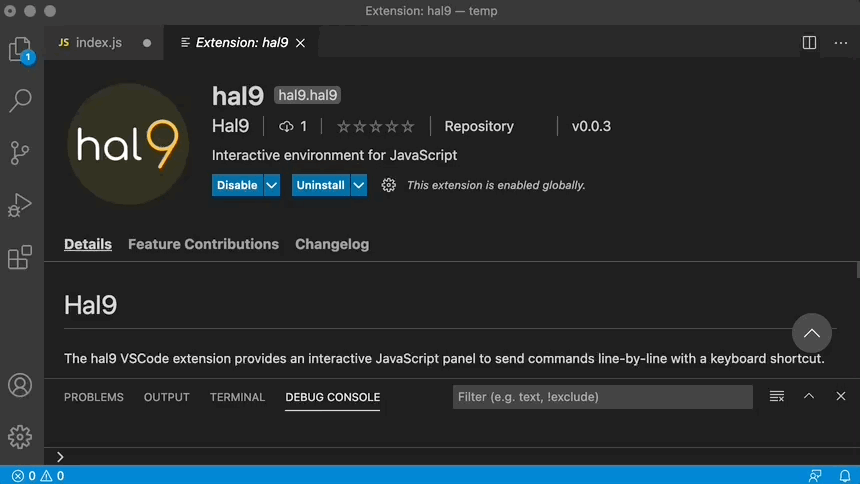

# Hal9

The hal9 VSCode extension runs code in an embedded browser with the `cmd + enter` shortcut.

This extension is ideal to rapidly iterate over visualizations by updating them instantaneously with `cmd + enter`; or to run line-by-line code selections with `cmd + enter` for long-running tasks; both use-cases are characteristic of Data Science, Machine Learning and Artificial Intelligence workflows.



## Getting Started

To use this extension, open the "Command Palette" and enable `hal9: Interactive JavaScript` which will open an "Output" window. You can then open a JavaScript file and send commands to this output window using `cmd + enter`.

This extension is ideal to perform interactive JavaScript commands; for instance, try sending the following command to write "Hello world!" in the JavaScript output window:

```js
document.body.innerText = 'Hello world!';
```

This extension makes use of [d3-require](https://github.com/d3/d3-require) to easily require dependencies, try sending the following example:

```js

d3 = await require('d3@6')

document.body.innerHTML = '';

d3.select(document.body).append('svg')
  .attr('width', '100%')
  .attr('height', '100%')
  .selectAll('circle')
  .data([1,2,3,4,5,6,7,8,9,10])
  .enter()
  .append('circle')
    .attr('r', e => 4 * e)
    .attr('cx', e => 30 * e)
    .attr('cy', 40)
    .attr('fill', 'yellow')
```

You can log commands back to the console using `console.log`, which has been overridden in the output window to write back to VSCode. Try sending the following line:

```js
console.log('Tada!');
```

## Contributing

Use yarn to install and compile this extension,

```
yarn install
yarn compile
```

Followed by running this extension from VSCode and packaging with `vsce`:

```
vsce package
```
