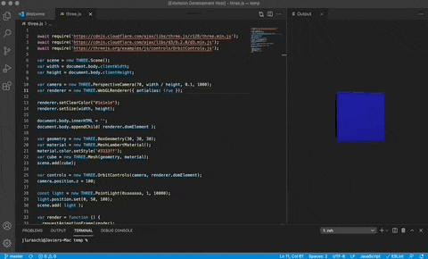

# Hal9

The hal9 VSCode extension runs code in an embedded browser with the `cmd + enter` shortcut.

This extension is ideal to rapidly iterate over visualizations by updating them instantaneously with `cmd + enter`; or to run line-by-line code selections with `cmd + enter` for long-running tasks; both use-cases are characteristic of Data Science, Machine Learning and Artificial Intelligence workflows.


## Getting Started

To use this extension, open the "Command Palette" and enable `hal9: Interactive JavaScript` which will open an "Output" window. You can then open a JavaScript file and send commands to this output window using `cmd + enter`.

This extension is ideal to perform interactive JavaScript commands; for instance, try sending the following command to write "Hello world!" in the JavaScript output window:

```js
document.body.innerText = 'Hello world!';
```

This extension makes use of [d3-require](https://github.com/d3/d3-require) to easily require dependencies, try sending the following example:

```js

d3 = await require('d3@6')

document.body.innerHTML = '';

d3.select(document.body).append('svg')
  .attr('width', '100%')
  .attr('height', '100%')
  .selectAll('circle')
  .data([1,2,3,4,5,6,7,8,9,10])
  .enter()
  .append('circle')
    .attr('r', e => 4 * e)
    .attr('cx', e => 30 * e)
    .attr('cy', 40)
    .attr('fill', 'yellow')
```

In addition, you can require arbitrary JavaScript libraries using a full URL; these libraries will get added as `<script>` tags in your document header. Let's try to do this with the `three.js` visualization library:

```js
await require('https://cdnjs.cloudflare.com/ajax/libs/three.js/r128/three.min.js');
await require('https://cdnjs.cloudflare.com/ajax/libs/d3/6.2.0/d3.min.js');
await require('https://threejs.org/examples/js/controls/OrbitControls.js');

var scene = new THREE.Scene();
var width = document.body.clientWidth;
var height = document.body.clientHeight;

var camera = new THREE.PerspectiveCamera(70, width / height, 0.1, 1000);
var renderer = new THREE.WebGLRenderer({ antialias: true });

renderer.setClearColor("#1e1e1e");
renderer.setSize(width, height);

document.body.innerHTML = '';
document.body.appendChild( renderer.domElement );

var geometry = new THREE.BoxGeometry(30, 30, 30);
var material = new THREE.MeshLambertMaterial();
material.color.setStyle('#3333ff');
var cube = new THREE.Mesh(geometry, material);
scene.add(cube);

var controls = new THREE.OrbitControls(camera, renderer.domElement);
camera.position.z = 100;

const light = new THREE.PointLight(0xaaaaaa, 1, 10000);
light.position.set(0, 50, 100);
scene.add( light );

var render = function () {
  requestAnimationFrame(render);
  cube.rotation.y += 0.01;
  controls.update();
  renderer.render(scene, camera);
};
render();
```



You can log commands back to the console using `console.log`, which has been overridden in the output window to write back to VSCode. Try sending the following line:

```js
console.log('Tada!');
```

## Contributing

Use yarn to install and compile this extension,

```
yarn install
yarn compile
```

Followed by running this extension from VSCode and packaging with `vsce`:

```
vsce package
```
